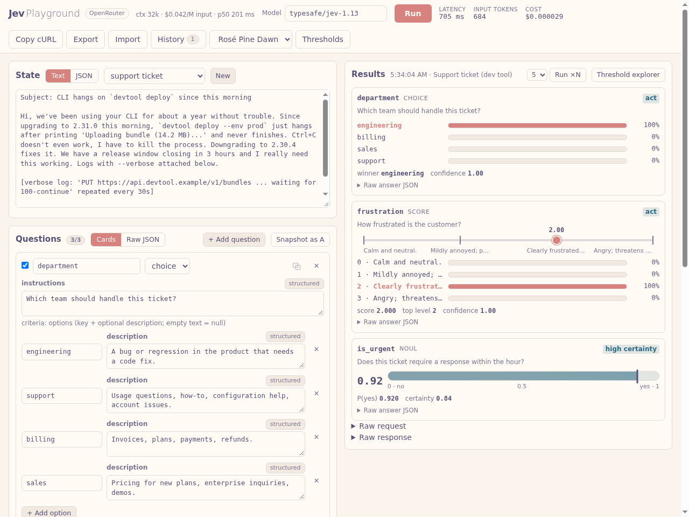

# Jev Playground (OpenRouter)

While waiting for my [TypeSafe.ai](https://typesafe.ai) invitation, I discovered that Jev is
also available through [OpenRouter](https://openrouter.ai). After a bit of experimenting in Python, I asked Claude (Fable) to generate a
playground app; this is the result. Not quite a single shot, but nice. You need an OpenRouter
API key.



## Requirements

- Python 3.10 or newer. **Standard library only, nothing to install.**
- An OpenRouter API key (https://openrouter.ai/keys).

## Run

```bash
git clone https://github.com/octanevz/jev-playground-openrouter.git   # or download and unzip
cd jev-playground-openrouter
export OPENROUTER_API_KEY=sk-or-...      # Windows: set OPENROUTER_API_KEY=sk-or-...
python3 server.py                        # then open http://127.0.0.1:3001
```

The key is read from the environment by the local server and never sent to the browser.
`--port`, `--host` and `--endpoint` are optional.

## Notes

- Presets live in `presets/`; `proof/preset-09.json` and `proof/preset-10.json` are captured
  live request/response pairs.
- OpenRouter rejects `null` for instructions, score levels and noul true/false (only Choice
  option descriptions may be null), and a noul `criteria` object needs both keys. The app
  validates this before sending.
